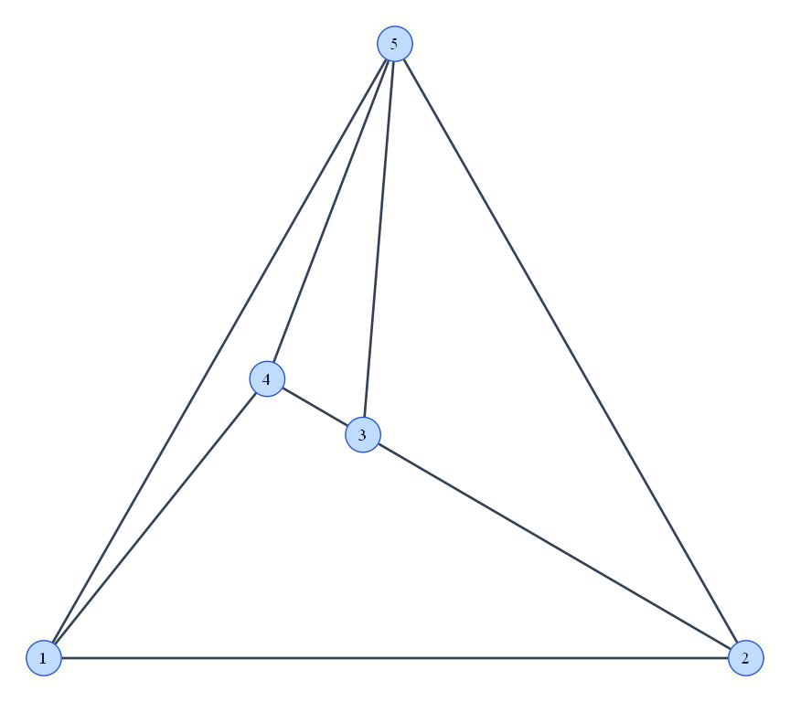
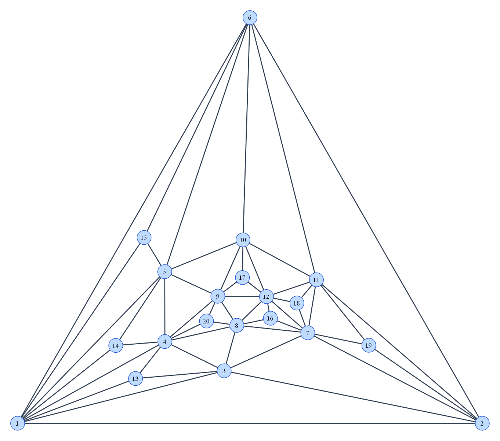

# Проверка планарности и укладка графа

**Выполнил:** Садилов Егор, ПМИ-2.

## Задание

Задание 6: проверить планарность заданного графа с помощью алгоритма комбинаторной укладки и,
если граф планарен, построить его геометрическую укладку.

Программа читает простой неориентированный граф из файла и проверяет его планарность
алгоритмом Демукрона.

Для планарного графа программа сохраняет в отчете порядок ребер вокруг каждой вершины и ее координаты,
а также создает PNG с прямыми ребрами без пересечений. Координаты вычисляются методом Тутте.

Если уложить граф не удалось, программа сообщает об этом в отчете и указывает,
через какие вершины неуложенный фрагмент соединяется с уже построенной частью графа.

Примеры результата:





---

## Структура проекта

- `model` - вершины, ребра, граф и координаты;
- `algorithm` - двусвязные блоки, алгоритм Демукрона и укладка Тутте;
- `io` - чтение входного графа, текстовый отчет и PNG;
- `Main.kt`- запуск основных этапов программы.

---

## Входной файл

Первая строка содержит:

```text
n m
```

где `n` — число вершин, `m` — число ребер.

Далее идут `m` строк вида:

```text
u v
```

Вершины нумеруются от `1` до `n`.
Петли и повторные ребра не допускаются. Изолированные вершины допускаются.

Пример `examples/planar.txt`:

```text
5 8
1 2
2 3
3 4
4 1
1 5
2 5
3 5
4 5
```

---

## Запуск

Для запуска необходимы:

- JDK 25;
- Graphviz;
- `neato` в `PATH`.

Команды выполняются из корня проекта:

```powershell
.\gradlew.bat run
.\gradlew.bat run --args="examples/k5.txt"
.\gradlew.bat run --args="examples/disconnected.txt"
.\gradlew.bat run --args="examples/triangulated-20.txt"
```

Без аргумента используется:

```text
examples/planar.txt
```

Отчет сохраняется в:

```text
results/txt/<имя>.txt
```

Для планарного графа дополнительно создается:

```text
results/png/<имя>.png
```

---

## Как работает комбинаторная укладка

Сначала граф разбивается на двусвязные блоки. Мосты и блоки, соединенные через точки сочленения, можно обрабатывать независимо.

Для блока, содержащего циклы, выбирается начальный цикл. Он образует первые две грани - внутреннюю и внешнюю.
После этого алгоритм ищет фрагменты графа, которые еще не были уложены.

Для каждого фрагмента определяются вершины примыкания к уже построенной части графа и грани,
в которых этот фрагмент можно разместить. Подходящей считается грань, содержащая на своей границе все вершины примыкания.

Если для какого-либо фрагмента подходящей грани нет, граф считается непланарным.
Иначе выбирается фрагмент с наименьшим количеством допустимых граней.

Из выбранного фрагмента выделяется цепь между двумя вершинами примыкания и добавляется в одну из подходящих граней.
Эта цепь разбивает старую грань на две новые. После этого оставшиеся фрагменты и их допустимые грани вычисляются заново.

Процесс продолжается, пока не будут уложены все ребра.

После успешной укладки определяется циклический порядок соседей каждой вершины. Например,

```text
1: 2 5 4
```

означает, что ребра вокруг вершины `1` идут в порядке `1-2`, `1-5`, `1-4`.
Этот порядок записывается в итоговый отчет.

---

## Как работает геометрическая укладка

После проверки планарности программа вычисляет координаты вершин.

Каждая связная компонента обрабатывается отдельно. Для компонент из одной вершины или одного ребра координаты задаются напрямую.

Для остальных компонент граф сначала дополняется ребрами, которые не нарушают его планарность.
Это нужно, чтобы получить максимальный планарный граф и выбрать треугольную внешнюю грань.

Вершинам внешней грани задаются фиксированные координаты. Координаты остальных вершин вычисляются методом Тутте.

Для каждой внутренней вершины выполняются условия

$$
x_v = \frac{1}{\deg(v)} \sum_{u \in N(v)} x_u,
$$

$$
y_v = \frac{1}{\deg(v)} \sum_{u \in N(v)} y_u.
$$

То есть координаты вершины равны среднему координат ее соседей в дополненном графе.

Так как положения внутренних вершин зависят друг от друга, для координат `x` и `y`
строятся системы линейных уравнений с общей матрицей коэффициентов:

$$
Ax=b_x,
$$

$$
Ay=b_y.
$$

Обе системы решаются совместно методом Гаусса.
После этого компоненты размещаются рядом со сдвигом по горизонтали.

Временно добавленные ребра используются только при вычислении укладки.
В итоговом PNG рисуются только ребра исходного графа.

---

## Пример работы

### Дано

В файле [examples/planar.txt](examples/planar.txt) задан граф из пяти вершин и восьми ребер:

```text
5 8
1 2
2 3
3 4
4 1
1 5
2 5
3 5
4 5
```

### Результат

Программа признала граф планарным. В [текстовом отчете](results/txt/planar.txt) записаны порядок ребер вокруг вершин и найденные координаты:

```text
Vertices: 5
Edges: 8

Planar: yes

Cyclic edge order:
1: 2 4 5
2: 1 5 3
3: 2 5 4
4: 1 3 5
5: 1 4 3 2

Coordinates:
1: (0.000000, 0.000000)
2: (4.000000, 0.000000)
3: (1.818182, 1.272727)
4: (1.272727, 1.590909)
5: (2.000000, 3.500000)
```

Например, строка `1: 2 4 5` показывает порядок ребер вокруг вершины 1. По найденным координатам построен [рисунок графа](results/png/planar.png).

---

## Другие примеры

| Граф | Проверка | Результат |
|---|---|---|
| [Планарный граф](examples/planar.txt) | Планарен | [Отчет](results/txt/planar.txt), [рисунок](results/png/planar.png) |
| [Дерево](examples/tree.txt) | Планарен | [Отчет](results/txt/tree.txt), [рисунок](results/png/tree.png) |
| [Несвязный граф](examples/disconnected.txt) | Планарен | [Отчет](results/txt/disconnected.txt), [рисунок](results/png/disconnected.png) |
| [Триангулированный граф, 20 вершин](examples/triangulated-20.txt) | Планарен | [Отчет](results/txt/triangulated-20.txt), [рисунок](results/png/triangulated-20.png) |
| [K₅](examples/k5.txt) | Непланарен | [Отчет](results/txt/k5.txt) |
| [K₃,₃](examples/k33.txt) | Непланарен | [Отчет](results/txt/k33.txt) |
